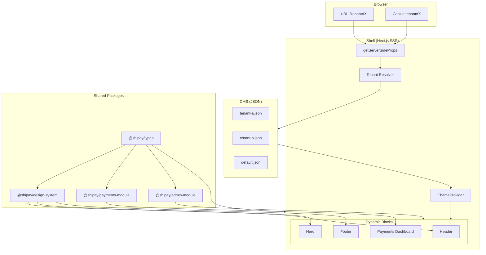

# Tech Challenge Shipay - Plataforma Multi-tenant com Microfrontends

> **Desafio Techlead Front-End Engineer Shipay**
>
> Este projeto implementa uma plataforma multi-tenant com arquitetura de microfrontends, design system escalavel e componentes reutilizaveis, atendendo a todos os requisitos do desafio tecnico.

---

## Indice

- [Requisitos Atendidos](#requisitos-atendidos)
- [Quick Start](#quick-start)
- [Arquitetura](#arquitetura)
- [1. Estrategia de Microfrontends & SSR](#1-estrategia-de-microfrontends--ssr)
- [2. Design System & Escalabilidade](#2-design-system--escalabilidade)
- [3. Abstracao de Componentes Complexos (Graficos)](#3-abstracao-de-componentes-complexos-graficos)
- [Trade-offs e Decisoes Tecnicas](#trade-offs-e-decisoes-tecnicas)
- [Extras: Maturidade de Projeto Real](#extras-maturidade-de-projeto-real)
- [Documentacao Complementar](#documentacao-complementar)

---

## Requisitos Atendidos

| Requisito do Desafio                     | Status | Implementacao                                |
| ---------------------------------------- | ------ | -------------------------------------------- |
| **Shell com SSR (Next.js)**              | ✅     | Next.js 14 com Pages Router                  |
| **Pagina recebendo Tenant (URL/Cookie)** | ✅     | 4 metodos: subdomain, cookie, query, default |
| **White Label para 2+ clientes**         | ✅     | tenant-a, tenant-b, default                  |
| **Admin Page (CMS)**                     | ✅     | /admin - edita config do tenant              |
| **Mudanca de logo por tenant**           | ✅     | `/logos/tenant-a.svg`, `/logos/tenant-b.svg` |
| **Mudanca de cor primaria por tenant**   | ✅     | CSS Variables dinamicas via ThemeProvider    |
| **Documentacao de Remote Apps**          | ✅     | Secao "Como Plugar Remote Apps"              |
| **Design Tokens (JSON/CSS)**             | ✅     | TypeScript + CSS Variables + SCSS            |
| **Componente consumindo tokens**         | ✅     | Button, Card, Chart                          |
| **Versionamento documentado**            | ✅     | Semantic Versioning + Changesets             |
| **Governanca documentada**               | ✅     | CONTRIBUTING.md + ADRs                       |
| **Interface TypeScript para graficos**   | ✅     | `ChartProps<T>` generico                     |
| **Componente agnostico ao provedor**     | ✅     | `mapDataPoint: (item: T) => ChartDataPoint`  |
| **Estados Loading/Empty/Error**          | ✅     | Todos implementados com acessibilidade       |
| **README Estrategico**                   | ✅     | Trade-offs e decisoes documentados           |
| **Diagrama de Arquitetura**              | ✅     | Mermaid + ASCII art                          |

---

## Quick Start

```bash
# Requisitos
node >= 20
pnpm >= 9

# Instalacao
pnpm install

# Desenvolvimento
pnpm dev

# Acessar aplicacao
# Default: http://localhost:3000
# Tenant A: http://localhost:3000?tenant=tenant-a
# Tenant B: http://localhost:3000?tenant=tenant-b
# Admin:    http://localhost:3000/admin?tenant=tenant-a
# Demo:     http://localhost:3000/demo
```

---

## Arquitetura

### Visao Geral



### Estrutura do Projeto

```
tech-challenge-shipay/
├── apps/
│   └── shell/                    # Next.js SSR Shell Application
│       ├── src/
│       │   ├── components/       # Componentes do Shell (BEM)
│       │   │   ├── Header/
│       │   │   ├── Hero/
│       │   │   └── Footer/
│       │   ├── lib/
│       │   │   └── tenant.ts           # Resolucao de tenant
│       │   ├── pages/
│       │   │   ├── index.tsx           # Home page
│       │   │   ├── admin.tsx           # Admin page (CMS)
│       │   │   └── api/admin/config.ts # API para salvar config
│       │   └── styles/           # Estilos globais SCSS
│       └── public/               # Assets estaticos (logos)
│
├── packages/
│   ├── design-system/            # Design System Compartilhado
│   │   └── src/
│   │       ├── components/       # Button, Card, Chart (BEM)
│   │       ├── tokens/           # Colors, Spacing, Typography
│   │       └── styles/           # Base SCSS + Breakpoints
│   │
│   ├── types/                    # TypeScript Types Compartilhados
│   │   └── src/index.ts          # TenantConfig, ChartProps<T>, etc
│   │
│   ├── payments-module/          # Microfrontend de Pagamentos
│   │   └── src/
│   │       ├── PaymentsDashboard.tsx
│   │       └── PaymentsDashboard.module.scss
│   │
│   └── admin-module/             # Microfrontend de Admin/CMS
│       └── src/
│           ├── AdminPanel.tsx
│           └── AdminPanel.module.scss
│
├── cms/
│   └── tenants/                  # Configuracoes JSON dos tenants
│       ├── default.json
│       ├── tenant-a.json
│       └── tenant-b.json
│
├── docs/                         # Documentacao
│   ├── ARCHITECTURE.md
│   ├── STYLEGUIDE.md
│   └── adr/                      # Architectural Decision Records
│
├── .github/
│   ├── workflows/                # CI/CD + AI Code Review
│   └── prompts/                  # Prompts para code review com IA
│
└── .claude/
    └── skills/                   # Skills para geracao de testes com IA
```

---

## 1. Estrategia de Microfrontends & SSR

### Resolucao de Tenant

O tenant e resolvido no servidor (`getServerSideProps`) com a seguinte prioridade:

```
┌─────────────────────────────────────────────────────────────┐
│                         Browser                              │
│  ┌─────────────┐  ┌─────────────┐  ┌─────────────────────┐  │
│  │ URL Query   │  │   Cookie    │  │     Subdomain       │  │
│  │ ?tenant=X   │  │  tenant=X   │  │  tenant-a.app.com   │  │
│  └──────┬──────┘  └──────┬──────┘  └──────────┬──────────┘  │
└─────────┼────────────────┼────────────────────┼─────────────┘
          │                │                    │
          ▼                ▼                    ▼
┌─────────────────────────────────────────────────────────────┐
│                    Shell (Next.js SSR)                       │
│  ┌────────────────────────────────────────────────────────┐ │
│  │              getServerSideProps                         │ │
│  │  ┌──────────────┐    ┌──────────────┐                  │ │
│  │  │ Tenant       │───▶│ Load Config  │                  │ │
│  │  │ Resolver     │    │ (JSON)       │                  │ │
│  │  └──────────────┘    └──────────────┘                  │ │
│  └────────────────────────────────────────────────────────┘ │
└─────────────────────────────────────────────────────────────┘
```

**Ordem de prioridade:**

1. **Subdominio** (producao): `tenant-a.shipay.com.br`
2. **Cookie Seguro** (persistencia): HttpOnly + Secure + SameSite
3. **Query Parameter** (dev only): `?tenant=tenant-a`
4. **Default**: Fallback para configuracao padrao

### Implementacao

```typescript
// apps/shell/src/lib/tenant.ts
export function resolveTenantId(ctx: GetServerSidePropsContext): string {
  const isDev = process.env.NODE_ENV === "development";

  // 1. Subdominio (primario para producao)
  const subdomainTenant = extractTenantFromSubdomain(ctx.req.headers.host);
  if (subdomainTenant && isValidTenant(subdomainTenant)) {
    return subdomainTenant;
  }

  // 2. Cookie seguro (fallback)
  const cookieTenant = ctx.req.cookies?.[TENANT_COOKIE_NAME];
  if (cookieTenant && isValidTenant(cookieTenant)) {
    return cookieTenant;
  }

  // 3. Query param (apenas dev)
  if (isDev) {
    const queryTenant = ctx.query.tenant;
    if (typeof queryTenant === "string" && isValidTenant(queryTenant)) {
      return queryTenant;
    }
  }

  return "default";
}
```

### Medidas de Seguranca

| Medida              | Descricao                           | Arquivo                      |
| ------------------- | ----------------------------------- | ---------------------------- |
| **Whitelist**       | Apenas tenant IDs pre-aprovados     | `tenant.ts:VALID_TENANTS`    |
| **Sanitizacao**     | Regex remove caracteres especiais   | `tenant.ts:sanitizeTenantId` |
| **HttpOnly Cookie** | Previne acesso via JavaScript (XSS) | `api/tenant.ts`              |
| **Secure Flag**     | Cookie apenas via HTTPS em producao | `api/tenant.ts`              |
| **SameSite=Strict** | Previne CSRF                        | `api/tenant.ts`              |

### Como Plugar Remote Apps (Microfrontends)

**Contexto**: O painel CMS sera dividido entre times de desenvolvimento, cada um responsavel por funcionalidades distintas de um produto (ex: pagamentos, relatorios, usuarios).

#### Arquitetura: Rotas por Modulo

Cada time e responsavel por seu proprio pacote e rota. O Shell apenas importa e renderiza:

```
┌─────────────────────────────────────────────────────────────────┐
│                         Shell (Next.js)                          │
├─────────────────────────────────────────────────────────────────┤
│                                                                  │
│   /                    → Pagina publica (tema do tenant)         │
│   /demo                → Demo do Design System                   │
│   /admin               → Editor de tema (@shipay/admin-module)   │
│   /admin/payments      → Time de Pagamentos                      │
│   /admin/reports       → Time de Relatorios                      │
│   /admin/users         → Time de Usuarios                        │
│                                                                  │
└─────────────────────────────────────────────────────────────────┘
          │                    │                    │
    ┌─────┴─────┐        ┌─────┴─────┐        ┌─────┴─────┐
    │ @shipay/  │        │ @shipay/  │        │ @shipay/  │
    │ admin-    │        │ payments- │        │ reports-  │
    │ module    │        │ module    │        │ module    │
    └───────────┘        └───────────┘        └───────────┘
```

#### Exemplo Real 1: `@shipay/payments-module`

O pacote `packages/payments-module` demonstra como um time cria seu modulo:

```
packages/payments-module/
├── src/
│   ├── PaymentsDashboard.tsx        # Componente principal
│   ├── PaymentsDashboard.module.scss
│   └── index.ts                     # Export publico
└── package.json
```

#### Exemplo Real 2: `@shipay/admin-module`

O pacote `packages/admin-module` e outro exemplo de modulo "plugado" no Shell. Ele foi extraido do proprio Shell para demonstrar o padrao de isolamento:

```
packages/admin-module/
├── src/
│   ├── AdminPanel.tsx               # Formulario de edicao de tenant
│   ├── AdminPanel.module.scss       # Estilos BEM com breakpoints
│   └── index.ts                     # Export publico
├── package.json
└── tsconfig.json
```

**O que faz:**

- Permite editar configuracoes do tenant (nome, cores, border-radius)
- Usa `@shipay/design-system` para componentes (Button)
- Usa `@shipay/types` para interfaces (TenantConfig, TenantTheme)
- Chama API `/api/admin/config` para persistir mudancas

**Como e usado no Shell:**

```tsx
// apps/shell/src/pages/admin.tsx
import { AdminPanel } from "@shipay/admin-module";

export default function AdminPage({ tenant }) {
  return <AdminPanel initialConfig={tenant} />;
}
```

**Por que extrair para um package?**

| Aspecto          | Beneficio                                            |
| ---------------- | ---------------------------------------------------- |
| **Isolamento**   | Admin module pode evoluir independentemente do Shell |
| **Consistencia** | Mesmo padrao do payments-module                      |
| **Reutilizacao** | Pode ser usado em outros Shells no futuro            |
| **Ownership**    | Time de Admin pode ter ownership do package          |
| **Testes**       | Testes unitarios isolados do Shell                   |

#### Passo a Passo: Adicionando um Novo Modulo

**1. Criar o pacote:**

```bash
mkdir packages/meu-modulo
```

```json
// packages/meu-modulo/package.json
{
  "name": "@shipay/meu-modulo",
  "version": "0.1.0",
  "main": "./src/index.ts",
  "dependencies": {
    "@shipay/design-system": "workspace:*",
    "@shipay/types": "workspace:*"
  }
}
```

**2. Implementar o componente:**

```tsx
// packages/meu-modulo/src/MeuModuloAdmin.tsx
import { Card, Button } from "@shipay/design-system";

export function MeuModuloAdmin() {
  return (
    <Card title="Configuracoes do Meu Modulo">
      <p>Interface de administracao do modulo</p>
      <Button>Salvar</Button>
    </Card>
  );
}
```

**3. Criar a rota no Shell:**

```tsx
// apps/shell/src/pages/admin/meu-modulo.tsx
import { MeuModuloAdmin } from "@shipay/meu-modulo";
import { withTenant } from "@/lib/tenant";

export const getServerSideProps = withTenant();

export default function MeuModuloPage({ tenant }) {
  return <MeuModuloAdmin tenantId={tenant.id} />;
}
```

Pronto! O novo modulo esta disponivel em `/admin/meu-modulo`.

#### Contrato entre Shell e Modulos

Cada modulo **deve**:

- Exportar componentes React nomeados
- Usar `@shipay/design-system` para consistencia visual
- Usar `@shipay/types` para interfaces compartilhadas
- Implementar estados: loading, error, empty
- Suportar `aria-label` para acessibilidade

**Por que esta abordagem?**

| Aspecto          | Beneficio                                       |
| ---------------- | ----------------------------------------------- |
| **Simplicidade** | Padrao Next.js nativo (pages)                   |
| **Isolamento**   | Cada time tem sua rota, nao interfere em outros |
| **Type Safety**  | Imports explicitos, erros em build time         |
| **Familiar**     | Desenvolvedores ja conhecem o padrao            |

#### Evolucao Futura: Sistema Dinamico de Blocos

Para cenarios mais complexos (ex: layouts customizaveis por tenant), a arquitetura pode evoluir para um sistema de blocos dinamicos:

```typescript
// Exemplo de evolucao futura (nao implementado)
// Registro central de blocos
const blocks = {
  "payments-dashboard": { component: PaymentsDashboard, ... },
  "reports-widget": { component: ReportsWidget, ... },
};

// Layout definido por tenant no JSON
{
  "layout": [
    { "type": "header" },
    { "type": "payments-dashboard" },
    { "type": "footer" }
  ]
}
```

Esta evolucao permitiria:

- Layouts diferentes por tenant
- Drag-and-drop no admin para reorganizar blocos
- Adicao de novos blocos sem deploy do Shell

Para o escopo atual, a abordagem de rotas e suficiente e mais simples.

### Admin Page (CMS White Label)

A pagina `/admin` demonstra a **UI do CMS** para edicao de configuracoes de tenant:

```bash
# Acessar admin do tenant-a
http://localhost:3000/admin?tenant=tenant-a
```

**O que a UI permite editar (demo):**

- Nome do tenant
- Cores do tema (primary, secondary, background, text)
- Border radius

**Arquitetura demonstrada:**

```
/admin (page)
    └── AdminPanel (@shipay/admin-module)
            └── Formulario de edicao de tema
```

> **Nota:** A persistencia dinamica de temas nao esta implementada neste MVP.
> O botao "Save Configuration" exibe uma mensagem informando que a feature
> esta em desenvolvimento. A arquitetura esta preparada para adicionar
> persistencia (via API ou banco de dados) quando necessario.

---

## 2. Design System & Escalabilidade

### Arquitetura de Tokens


### Tokens Definidos

```scss
// packages/design-system/src/styles/base.scss
:root {
  // Cores (sobrescritas por tenant)
  --color-primary: #3b82f6;
  --color-secondary: #6b7280;
  --color-background: #ffffff;
  --color-text: #171717;
  --color-error: #ef4444;
  --color-success: #22c55e;

  // Espacamento
  --spacing-1: 0.25rem; // 4px
  --spacing-2: 0.5rem; // 8px
  --spacing-4: 1rem; // 16px
  --spacing-6: 1.5rem; // 24px
  --spacing-8: 2rem; // 32px

  // Tipografia
  --font-size-sm: 0.875rem;
  --font-size-base: 1rem;
  --font-size-lg: 1.125rem;
  --font-size-xl: 1.25rem;

  // Outros
  --border-radius: 0.5rem;
  --shadow-sm: 0 1px 2px rgba(0, 0, 0, 0.05);
  --transition-fast: 150ms ease;
}
```

### Metodologia SCSS + BEM

Uso **BEM (Block Element Modifier)** para nomenclatura de classes CSS:

```scss
// Block: componente standalone
.button {
}

// Element: parte do bloco (underscore duplo)
.button__spinner {
}
.button__text {
}

// Modifier: variacao (hifen duplo)
.button--primary {
}
.button--loading {
}
```

**Exemplo completo:**

```scss
// packages/design-system/src/components/Button/Button.module.scss
@use "../../styles/breakpoints" as *;

.button {
  display: inline-flex;
  align-items: center;
  padding: var(--spacing-2) var(--spacing-4);
  border-radius: var(--border-radius);
  transition: var(--transition-fast);

  // Modifiers
  &--primary {
    background-color: var(--color-primary);
    color: white;
  }

  &--secondary {
    background-color: transparent;
    border: 1px solid var(--color-primary);
  }

  &--loading {
    pointer-events: none;
  }

  // Elements
  &__spinner {
    position: absolute;
    inset: 0;
  }

  // Responsivo
  @include md {
    padding: var(--spacing-3) var(--spacing-6);
  }
}
```

### Breakpoints Responsivos

CSS Variables nao funcionam em media queries, entao uso SCSS mixins:

```scss
@use "@shipay/design-system/styles/breakpoints" as *;

.component {
  padding: var(--spacing-4); // Mobile default

  @include md {
    // >= 768px
    padding: var(--spacing-6);
  }

  @include lg {
    // >= 1024px
    padding: var(--spacing-8);
  }
}
```

| Mixin         | Breakpoint | Uso              |
| ------------- | ---------- | ---------------- |
| `@include xs` | >= 480px   | Mobile grande    |
| `@include sm` | >= 640px   | Tablet portrait  |
| `@include md` | >= 768px   | Tablet landscape |
| `@include lg` | >= 1024px  | Desktop          |
| `@include xl` | >= 1280px  | Desktop grande   |

### Versionamento do Design System

Uso **Semantic Versioning** (MAJOR.MINOR.PATCH) com **Changesets**:

| Tipo de Mudanca  | Bump  | Exemplo                                    |
| ---------------- | ----- | ------------------------------------------ |
| Breaking changes | MAJOR | Remocao de props, mudanca de comportamento |
| Novas features   | MINOR | Novos componentes, novas props opcionais   |
| Bug fixes        | PATCH | Correcao de estilos, typos                 |

**Como funciona:**

```bash
# Ao fazer uma mudanca, criar changeset
pnpm changeset

# Ao preparar release
pnpm version    # Atualiza versoes baseado nos changesets
pnpm release    # Publica packages
```

### Governanca do Design System

| Processo         | Descricao                                           |
| ---------------- | --------------------------------------------------- |
| **RFC**          | Breaking changes requerem Request for Comments      |
| **Pull Request** | Todas mudancas passam por code review               |
| **Aprovacao**    | Minimo 1 aprovacao de maintainer                    |
| **Documentacao** | Atualizar README/Storybook                          |
| **ADR**          | Decisoes arquiteturais documentadas em `/docs/adr/` |

**Estrutura de time:**

- **Maintainers**: Core team com direitos de merge
- **Contributors**: Qualquer um pode submeter PRs
- **Consumers**: Times de MFE que usam o DS

---

## 3. Abstracao de Componentes Complexos (Graficos)

### Interface TypeScript

O componente Chart usa **generics** para ser completamente agnostico ao tipo de dados:

```typescript
// packages/types/src/index.ts

export interface ChartState {
  loading?: boolean;
  error?: Error | string | null;
  empty?: {
    message: string;
    icon?: ReactNode;
  };
}

export interface ChartDataPoint {
  label: string;
  value: number;
  color?: string;
}

export interface ChartProps<T> {
  data: T[];
  state?: ChartState;
  mapDataPoint: (item: T) => ChartDataPoint; // Transformacao de dados
  formatValue?: (value: number) => string;
  title?: string;
  "aria-label"?: string;
  height?: number;
}
```

### Uso do Componente

```tsx
// Exemplo: Dashboard de pagamentos
interface Payment {
  id: string;
  month: string;
  amount: number;
  status: "completed" | "pending";
}

const payments: Payment[] = [
  { id: "1", month: "Jan", amount: 15000, status: "completed" },
  { id: "2", month: "Fev", amount: 22000, status: "completed" },
];

<Chart<Payment>
  data={payments}
  mapDataPoint={(payment) => ({
    label: payment.month,
    value: payment.amount,
    color: payment.status === "completed" ? "#22c55e" : "#f59e0b",
  })}
  formatValue={(value) => `R$ ${value.toLocaleString()}`}
  title="Pagamentos por Mes"
  aria-label="Grafico de barras mostrando pagamentos mensais"
/>;
```

### Estados do Componente

| Estado      | Visual                        | Codigo                                        |
| ----------- | ----------------------------- | --------------------------------------------- |
| **Loading** | Spinner + "Carregando..."     | `state={{ loading: true }}`                   |
| **Error**   | Icone + mensagem de erro      | `state={{ error: "Falha ao carregar" }}`      |
| **Empty**   | Icone + mensagem customizavel | `state={{ empty: { message: "Sem dados" } }}` |
| **Data**    | Grafico de barras             | `data={[...]}`                                |

```tsx
// Loading
<Chart data={[]} state={{ loading: true }} mapDataPoint={...} />

// Error
<Chart data={[]} state={{ error: "Erro de conexao" }} mapDataPoint={...} />

// Empty
<Chart
  data={[]}
  state={{ empty: { message: "Nenhum pagamento encontrado" } }}
  mapDataPoint={...}
/>
```

### Implementacao CSS Pura

O grafico e implementado em **CSS puro** (sem bibliotecas como Recharts) para demonstrar a abstracao:

```scss
// packages/design-system/src/components/Chart/Chart.module.scss
.chart {
  &__bars {
    display: flex;
    align-items: flex-end;
    gap: var(--spacing-2);
    height: 200px;
  }

  &__bar {
    flex: 1;
    background-color: var(--color-primary);
    border-radius: var(--border-radius) var(--border-radius) 0 0;
    transition: var(--transition-fast);

    &:hover {
      opacity: 0.8;
    }
  }

  &__loading,
  &__empty,
  &__error {
    display: flex;
    flex-direction: column;
    align-items: center;
    justify-content: center;
    min-height: 200px;
    color: var(--color-text-secondary);
  }
}
```

---

## Trade-offs e Decisoes Tecnicas

### Pages Router vs App Router

| Aspecto          | Pages Router (escolhido)     | App Router                   |
| ---------------- | ---------------------------- | ---------------------------- |
| **Maturidade**   | Estavel, battle-tested       | Mais novo, alguns edge cases |
| **SSR**          | `getServerSideProps` simples | Server Components            |
| **Complexidade** | Menor                        | Maior curva de aprendizado   |
| **Ecossistema**  | Mais bibliotecas compativeis | Suporte crescente            |

**Decisao**: Pages Router pela simplicidade e estabilidade. O padrao de tenant resolution funciona perfeitamente com `getServerSideProps`.

> Ver [ADR-004: Pages Router](docs/adr/ADR-004-pages-router.md)

### CSS Variables vs CSS-in-JS

| Aspecto             | CSS Variables (escolhido) | CSS-in-JS            |
| ------------------- | ------------------------- | -------------------- |
| **Performance**     | Zero overhead em runtime  | Custo em runtime     |
| **SSR**             | Suporte nativo            | Precisa de hydration |
| **Temas dinamicos** | Facil via style attr      | Mais complexo        |
| **Bundle size**     | Menor                     | Adiciona peso de lib |

**Decisao**: CSS Variables para performance e simplicidade. Mudanca de tema e instantanea sem JavaScript.

> Ver [ADR-002: CSS Variables](docs/adr/ADR-002-css-variables.md)

### SCSS + BEM vs Tailwind vs CSS-in-JS

| Aspecto                  | SCSS + BEM (escolhido) | Tailwind            | CSS-in-JS         |
| ------------------------ | ---------------------- | ------------------- | ----------------- |
| **Curva de aprendizado** | CSS padrao             | Classes utilitarias | Nova API          |
| **Manutenibilidade**     | Nomenclatura clara     | Strings longas      | Estilos dispersos |
| **Performance**          | Build-time             | CSS maior           | Runtime overhead  |
| **Especificidade**       | Plana, previsivel      | Utility-based       | Scoped            |

**Decisao**: SCSS + BEM para manutenibilidade, performance e familiaridade do time.

> Ver [ADR-005: SCSS + BEM](docs/adr/ADR-005-scss-bem-methodology.md)

### Build-time vs Runtime Federation

| Aspecto          | Build-time (escolhido) | Runtime (Module Federation) |
| ---------------- | ---------------------- | --------------------------- |
| **Complexidade** | Menor                  | Maior                       |
| **Deploy**       | Monorepo deploy        | Deploys independentes       |
| **Type safety**  | Suporte completo       | Limitado                    |
| **Bundle**       | Tree-shaking funciona  | Mais dificil otimizar       |

**Decisao**: Build-time para MVP. Preparado para migrar para runtime federation no futuro se necessário.

> Ver [ADR-003: Build-time Federation](docs/adr/ADR-003-build-time-federation.md)

---

## Extras: Maturidade de Projeto Real

Alem dos requisitos do desafio, este projeto implementa praticas de um projeto **pronto para producao**:

### 1. Testes Automatizados com IA

**Stack de testes:**

- **Vitest** - Test runner moderno e rapido
- **@testing-library/react** - Testes focados no usuario
- **@testing-library/jest-dom** - Matchers de DOM

**Cobertura de testes:**

| Componente    | Arquivo                  | Testes |
| ------------- | ------------------------ | ------ |
| Button        | `Button.test.tsx`        | 19     |
| Card          | `Card.test.tsx`          | 12     |
| Chart         | `Chart.test.tsx`         | 18     |
| ThemeProvider | `ThemeProvider.test.tsx` | 15     |
| tenant.ts     | `tenant.test.ts`         | 14     |

**Geracao de testes com Claude Code:**

```bash
# Gerar testes automaticamente seguindo padroes do projeto
/generate-tests packages/design-system/src/components/Button/Button.tsx
```

A skill `/generate-tests`:

1. Le o componente e entende suas props
2. Analisa padroes de testes existentes
3. Gera arquivo `.test.tsx` completo

> Ver [.claude/skills/generate-tests/SKILL.md](.claude/skills/generate-tests/SKILL.md)

### 2. Code Reviews Automatizados com IA

**GitHub Action com Claude:**

```yaml
# .github/workflows/ai-code-review.yml
name: AI Code Review

on:
  pull_request:
    types: [opened, synchronize]

jobs:
  ai-review:
    runs-on: ubuntu-latest
    steps:
      - name: Run AI Code Review
        env:
          ANTHROPIC_API_KEY: ${{ secrets.ANTHROPIC_API_KEY }}
        run: node .github/scripts/ai-code-review.js
```

**O que o review automatizado verifica:**

- Uso correto de design tokens (cores hardcoded em style={{}})
- Uso de componentes do Design System (`<Button>` ao inves de `<button>`)
- Acessibilidade basica (aria-label em elementos interativos)
- Codigo limpo (console.log, secrets expostos)

> **Nota MVP:** Os prompts de IA foram simplificados para este teste, focando apenas em issues obvios e evitando falsos positivos. Em producao, os prompts seriam mais abrangentes e utilizariam um modelo mais capaz (Claude Sonnet/Opus ao inves de Haiku).

> Ver [.github/prompts/design-system.md](.github/prompts/design-system.md)

#### Use Cases: Exemplos Reais de PRs

Para demonstrar o fluxo de trabalho e a eficacia do AI Code Review, criei dois PRs de exemplo:

---

**Use Case 1: PR Aprovado (Payments Team)**

> **PR:** [feat(payments): add average ticket stat card](https://github.com/Emanuel-Ramos/tech-challenge/pull/8)

O time de Payments adicionou um novo card de estatistica "Average Ticket" ao dashboard:

```typescript
// packages/payments-module/src/PaymentsDashboard.tsx
const averageTicket = totalTransactions > 0 ? totalRevenue / totalTransactions : 0;

<Card>
  <span className={styles["dashboard__stat-label"]}>Average Ticket</span>
  <span className={styles["dashboard__stat-value"]}>{formatCurrency(averageTicket)}</span>
</Card>
```

**Por que passou no review:**

- ✅ Usa componentes do Design System (`Card`)
- ✅ Segue metodologia BEM para classes CSS
- ✅ Usa design tokens via CSS Variables
- ✅ Inclui changeset para versionamento
- ✅ Build, lint e testes passam

---

**Use Case 2: PR com Issues (Admin Team)**

> **PR:** [feat(admin): add reset button](https://github.com/Emanuel-Ramos/tech-challenge/pull/7)

O time de Admin adicionou um botao Reset com varios anti-patterns intencionais:

```tsx
// ❌ Codigo com problemas
<button
  type="button"
  onClick={handleReset}
  style={{
    backgroundColor: "#6b7280", // Hardcoded color
    color: "#ffffff", // Hardcoded color
    padding: "8px 16px", // Inline style
  }}
  className="reset-btn" // Non-BEM class
>
  Reset
</button>
```

**Issues identificados pelo AI Review:**

| Issue                 | Descricao                                      | Severidade |
| --------------------- | ---------------------------------------------- | ---------- |
| Nao usa Design System | `<button>` nativo ao inves de `<Button>`       | Alta       |
| Cores hardcoded       | `#6b7280` ao inves de `var(--color-secondary)` | Alta       |
| Inline styles         | `style={{...}}` ao inves de SCSS               | Media      |
| Falta aria-label      | Botao sem label de acessibilidade              | Media      |
| Classe non-BEM        | `.reset-btn` ao inves de `.admin-panel__reset` | Baixa      |
| Falta focus state     | CSS sem `:focus-visible`                       | Media      |

**Como deveria ser:**

```tsx
// ✅ Codigo seguindo padroes
<Button
  type="button"
  variant="secondary"
  onClick={handleReset}
  aria-label="Reset form to initial values"
>
  Reset
</Button>
```

---

### 3. CI/CD Pipeline Completo

```yaml
# .github/workflows/ci.yml
jobs:
  lint: # ESLint em todos os packages
  typecheck: # TypeScript strict mode
  build: # Build de producao
  test: # Testes unitarios
```

| Job         | Validacao                   |
| ----------- | --------------------------- |
| `lint`      | ESLint em todos os packages |
| `typecheck` | TypeScript `--noEmit`       |
| `build`     | Build de producao Next.js   |
| `test`      | Vitest com cobertura        |

### 4. Git Hooks (Husky)

| Hook         | Validacao                         |
| ------------ | --------------------------------- |
| `pre-commit` | Prettier nos arquivos staged      |
| `commit-msg` | Conventional Commits (commitlint) |

**Conventional Commits obrigatorio:**

```bash
# Formato
<tipo>(<escopo>): <descricao>

# Exemplos
feat(button): add loading spinner
fix(tenant): resolve cookie expiration
refactor(payments): migrate to scss
docs: update contributing guide
```

### 5. Changesets para Versionamento

```json
// .changeset/config.json
{
  "linked": [
    ["@shipay/design-system", "@shipay/payments-module", "@shipay/admin-module", "@shipay/types"]
  ],
  "baseBranch": "master"
}
```

**Workflow:**

```bash
# Ao fazer mudanca
pnpm changeset          # Cria changeset descrevendo mudanca

# Ao preparar release
pnpm version            # Bump versions baseado nos changesets
pnpm release            # Publica packages
```

### 6. Architectural Decision Records (ADRs)

Todas as decisoes arquiteturais sao documentadas:

| ADR                                                      | Decisao                           |
| -------------------------------------------------------- | --------------------------------- |
| [ADR-001](docs/adr/ADR-001-tenant-resolution.md)         | Estrategia de Resolucao de Tenant |
| [ADR-002](docs/adr/ADR-002-css-variables.md)             | CSS Variables para Theming        |
| [ADR-003](docs/adr/ADR-003-build-time-federation.md)     | Build-time Federation             |
| [ADR-004](docs/adr/ADR-004-pages-router.md)              | Next.js Pages Router              |
| [ADR-005](docs/adr/ADR-005-scss-bem-methodology.md)      | SCSS + BEM Methodology            |
| [ADR-006](docs/adr/ADR-006-stable-framework-versions.md) | Next.js 14 LTS                    |

### 7. Acessibilidade (WCAG 2.1 AA)

| Feature                 | Implementacao                         |
| ----------------------- | ------------------------------------- |
| **Keyboard Navigation** | Tab/Enter/Escape em todos interativos |
| **Focus Visible**       | `:focus-visible` com alto contraste   |
| **ARIA Labels**         | Descritivos em Chart, Button          |
| **ARIA States**         | `aria-busy`, `aria-disabled`          |
| **Semantic HTML**       | Hierarquia de headings, `<button>`    |
| **Color Contrast**      | Minimo 4.5:1 para texto               |
| **Screen Reader**       | Textos alternativos significativos    |

### 8. Documentacao Estruturada

| Documento                                    | Conteudo                |
| -------------------------------------------- | ----------------------- |
| [README.md](README.md)                       | Overview e como comecar |
| [CONTRIBUTING.md](CONTRIBUTING.md)           | Guia de contribuicao    |
| [docs/ARCHITECTURE.md](docs/ARCHITECTURE.md) | Arquitetura detalhada   |
| [docs/STYLEGUIDE.md](docs/STYLEGUIDE.md)     | Padroes de codigo       |
| [docs/adr/](docs/adr/)                       | Decisoes arquiteturais  |

### 9. Comandos de Desenvolvimento

```bash
# Desenvolvimento
pnpm dev                    # Servidor de desenvolvimento
pnpm build                  # Build de producao
pnpm start                  # Servidor de producao

# Qualidade
pnpm lint                   # ESLint em todos packages
pnpm typecheck              # TypeScript check
pnpm format                 # Prettier format
pnpm format:check           # Prettier check

# Testes
pnpm test                   # Watch mode
pnpm test:run               # Single run
pnpm test:coverage          # Com cobertura
pnpm test:ui                # Interface visual

# Release
pnpm changeset              # Criar changeset
pnpm version                # Bump versions
pnpm release                # Publicar packages
pnpm validate               # Build + Test + Lint
```

### 10. Seguranca por Padrao

| Medida               | Implementacao                 |
| -------------------- | ----------------------------- |
| Whitelist de tenants | Previne tenant injection      |
| Sanitizacao de input | Regex em `tenant.ts`          |
| HttpOnly cookies     | Previne XSS                   |
| Secure cookies       | HTTPS only em prod            |
| SameSite=Strict      | Previne CSRF                  |
| No info disclosure   | Erros genericos para usuarios |

---

**Stack:** Next.js 14 | React 18 | TypeScript | SCSS | pnpm workspaces | Vitest | Husky | Changesets | GitHub Actions

**Autor:** Emanuel - Tech Challenge Shipay
