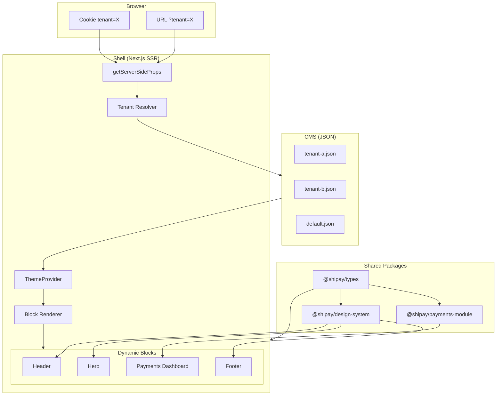
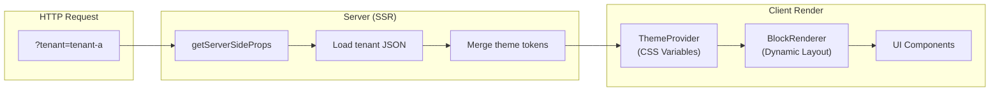
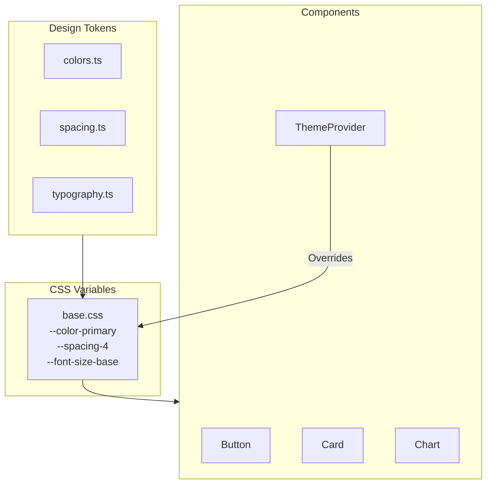

# Tech Challenge Shipay - Multi-tenant Microfrontend Platform

A modern multi-tenant platform built with Next.js, featuring a modular microfrontend architecture, a reusable design system, and CMS-driven layouts.

## Architecture Overview



### Component Flow



### Design System Architecture



## Project Structure

```
tech-challenge-shipay/
├── apps/
│   └── shell/                    # Next.js SSR Shell Application
│       ├── src/
│       │   ├── components/       # Shell-specific components
│       │   ├── lib/              # Utilities (tenant resolution)
│       │   ├── pages/            # Next.js pages
│       │   └── styles/           # Global styles
│       └── public/               # Static assets (logos)
├── packages/
│   ├── design-system/            # Shared Design System
│   │   └── src/
│   │       ├── components/       # Button, Card, Chart, ThemeProvider
│   │       ├── tokens/           # Colors, Spacing, Typography
│   │       └── styles/           # Base CSS with variables
│   ├── types/                    # Shared TypeScript types
│   │   └── src/
│   │       └── index.ts          # All interfaces and types
│   └── payments-module/          # Payments Microfrontend
│       └── src/
│           └── PaymentsDashboard.tsx
├── cms/
│   └── tenants/                  # Tenant configuration JSON files
│       ├── default.json
│       ├── tenant-a.json
│       └── tenant-b.json
├── pnpm-workspace.yaml           # Monorepo configuration
└── package.json                  # Root package.json
```

## Quick Start

```bash
# Install pnpm if not installed
npm install -g pnpm

# Install dependencies
pnpm install

# Start development server
pnpm dev

# Open in browser
# Default: http://localhost:3000
# Tenant A: http://localhost:3000?tenant=tenant-a
# Tenant B: http://localhost:3000?tenant=tenant-b
# Demo page: http://localhost:3000/demo
```

## Multi-Tenancy

### How Tenant Resolution Works

The tenant is resolved in `getServerSideProps` with the following priority:

1. **Subdomain** (production): `tenant-a.shipay.com`
2. **Secure Cookie** (fallback): For session persistence
3. **Query Parameter** (dev only): `?tenant=tenant-a` for testing
4. **Default**: Falls back to the `default` tenant configuration

```typescript
// apps/shell/src/lib/tenant.ts
export function resolveTenantId(ctx: GetServerSidePropsContext): string {
  const isDev = process.env.NODE_ENV === "development";

  // 1. Check subdomain (primary for production)
  const host = ctx.req.headers.host;
  const subdomainTenant = extractTenantFromSubdomain(host);
  if (subdomainTenant && isValidTenant(subdomainTenant)) {
    return subdomainTenant;
  }

  // 2. Check secure cookie (fallback for debug)
  const cookieTenant = ctx.req.cookies?.[TENANT_COOKIE_NAME];
  if (cookieTenant && isValidTenant(cookieTenant)) {
    return cookieTenant;
  }

  // 3. Query param (dev only)
  if (isDev) {
    const queryTenant = ctx.query.tenant;
    if (typeof queryTenant === "string" && isValidTenant(queryTenant)) {
      return queryTenant;
    }
  }

  return "default";
}
```

### Security Measures

| Measure                  | Description                                       |
| ------------------------ | ------------------------------------------------- |
| **Whitelist validation** | Only allowed tenant IDs are accepted              |
| **Input sanitization**   | Prevents injection attacks                        |
| **HttpOnly cookie**      | Cannot be accessed by JavaScript (XSS protection) |
| **Secure flag**          | Cookie only sent over HTTPS in production         |
| **SameSite=Strict**      | Prevents CSRF attacks                             |

### Tenant Selection API

```bash
# Get available tenants
GET /api/tenant
# Response: { "tenants": ["tenant-a", "tenant-b", "default"], "current": "tenant-a" }

# Set tenant (sets secure cookie)
POST /api/tenant
# Body: { "tenant": "tenant-b" }

# Clear tenant selection
DELETE /api/tenant
```

### Testing Locally

```bash
# Via query param (dev mode only)
http://localhost:3000?tenant=tenant-a

# Via tenant selection page
http://localhost:3000/select-tenant

# Simulate subdomain (add to /etc/hosts or Windows hosts file)
127.0.0.1 tenant-a.localhost
# Then access: http://tenant-a.localhost:3000
```

### Scalability for N Tenants

- Tenant configs are stored as JSON files in `cms/tenants/`
- Adding a new tenant requires only a new JSON file
- In production, these could be stored in a database or headless CMS
- The architecture supports unlimited tenants with O(1) lookup time

## Design System

### Token Architecture

The design system uses CSS custom properties for theming:

```css
:root {
  /* Tenant-overridable */
  --color-primary: #3b82f6;
  --color-secondary: #6b7280;
  --color-background: #ffffff;
  --color-text: #171717;
  --border-radius: 0.5rem;

  /* System tokens */
  --spacing-4: 1rem;
  --font-size-base: 1rem;
  --shadow-sm: 0 1px 2px rgba(0, 0, 0, 0.05);
}
```

### Components

| Component       | Description                 | Props                                          |
| --------------- | --------------------------- | ---------------------------------------------- |
| `Button`        | Primary interaction element | `variant`, `size`, `loading`, `disabled`       |
| `Card`          | Content container           | `title`, `children`                            |
| `Chart`         | Generic data visualization  | `data`, `state`, `mapDataPoint`, `formatValue` |
| `ThemeProvider` | Applies tenant theme        | `theme`                                        |

### Chart Component Interface

```typescript
interface ChartProps<T> {
  data: T[];
  state?: {
    loading?: boolean;
    error?: Error | string | null;
    empty?: { message: string; icon?: ReactNode };
  };
  mapDataPoint: (item: T) => { label: string; value: number; color?: string };
  formatValue?: (value: number) => string;
  title?: string;
  "aria-label"?: string;
  height?: number;
}
```

The chart supports:

- **Loading state**: Shows spinner with "Loading..." text
- **Error state**: Displays error message with icon
- **Empty state**: Shows customizable empty message
- **Data state**: Renders bar chart with values

### Versionamento do Design System

We follow **Semantic Versioning** (MAJOR.MINOR.PATCH):

| Change Type                        | Version Bump | Example                           |
| ---------------------------------- | ------------ | --------------------------------- |
| Breaking API changes               | MAJOR        | Removing props, changing behavior |
| New features (backward-compatible) | MINOR        | Adding new components             |
| Bug fixes                          | PATCH        | Fixing styling issues             |

**How we ensure stability:**

1. **Explicit versioning**: Each MFE declares the DS version in `package.json`
2. **Changelog**: All changes are documented with migration guides
3. **Breaking changes**: Only in MAJOR versions with deprecation warnings
4. **Visual regression tests**: (Future) Chromatic/Percy integration

### Governança do Design System

**Contribution Process:**

1. **RFC (Request for Comments)**: Breaking changes require an RFC
2. **Pull Request**: All changes go through PR review
3. **Approval**: Minimum 1 maintainer approval required
4. **Documentation**: Update Storybook (future) and README

**Team Structure:**

- **Maintainers**: Core team with merge rights
- **Contributors**: Anyone can submit PRs
- **Consumers**: MFE teams that use the DS

## Microfrontends

### How Remote Apps Work

Each microfrontend is a separate package that exports React components:

```typescript
// packages/payments-module/src/index.ts
export { PaymentsDashboard } from "./PaymentsDashboard";
```

### How to Plug a New Remote App

1. **Create a new package**:

```bash
mkdir packages/new-module
```

2. **Configure package.json**:

```json
{
  "name": "@shipay/new-module",
  "main": "./src/index.ts",
  "dependencies": {
    "@shipay/design-system": "workspace:*",
    "@shipay/types": "workspace:*"
  }
}
```

3. **Implement the component**:

```typescript
// packages/new-module/src/MyComponent.tsx
import { Card, Button } from "@shipay/design-system";

export function MyComponent({ data }: MyComponentProps) {
  return (
    <Card title="My Module">
      <Button onClick={handleAction}>Action</Button>
    </Card>
  );
}
```

4. **Register as a block type** in the shell:

```typescript
// apps/shell/src/components/BlockRenderer/BlockRenderer.tsx
case "new-module":
  return <MyComponent key={...} {...block.props} />;
```

5. **Add to tenant layout**:

```json
{
  "layout": [{ "type": "new-module", "props": { "config": "value" } }]
}
```

### Contract Between Shell and MFEs

Each MFE must:

- Export named React components
- Use `@shipay/design-system` for UI consistency
- Use `@shipay/types` for shared interfaces
- Handle loading, error, and empty states
- Support `aria-label` for accessibility

## Trade-offs and Decisions

### Why Pages Router vs App Router?

| Aspect         | Pages Router (chosen)       | App Router             |
| -------------- | --------------------------- | ---------------------- |
| **Maturity**   | Stable, battle-tested       | Newer, some edge cases |
| **SSR**        | Simple `getServerSideProps` | Server Components      |
| **Complexity** | Lower                       | Higher learning curve  |
| **Ecosystem**  | More libraries compatible   | Growing support        |

**Decision**: Pages Router for simplicity and stability. The tenant resolution pattern works perfectly with `getServerSideProps`.

### Why CSS Variables vs CSS-in-JS?

| Aspect             | CSS Variables (chosen) | CSS-in-JS           |
| ------------------ | ---------------------- | ------------------- |
| **Performance**    | No runtime overhead    | Runtime cost        |
| **SSR**            | Native support         | Needs hydration     |
| **Dynamic themes** | Easy with style attr   | More complex        |
| **Bundle size**    | Smaller                | Adds library weight |

**Decision**: CSS Variables for performance and simplicity. Theme switching is instant and doesn't require JavaScript.

### Why Build-time vs Runtime Federation?

| Aspect                  | Build-time (chosen) | Runtime (Module Federation) |
| ----------------------- | ------------------- | --------------------------- |
| **Complexity**          | Lower               | Higher                      |
| **Deployment**          | Monorepo deploy     | Independent deploys         |
| **Type safety**         | Full support        | Limited                     |
| **Bundle optimization** | Tree-shaking works  | Harder to optimize          |

### Why pnpm Workspaces?

- **Efficiency**: Shared dependencies with symlinks
- **Speed**: Faster than npm/yarn workspaces
- **Disk space**: Single node_modules for shared deps
- **Strict mode**: Prevents phantom dependencies

## Accessibility

All components follow WCAG guidelines:

- **Focus visible**: `:focus-visible` outlines for keyboard navigation
- **ARIA labels**: Charts have descriptive `aria-label` attributes
- **Color contrast**: Minimum 4.5:1 ratio for text
- **Semantic HTML**: Proper heading hierarchy, button elements

### Testing Accessibility

1. Use browser DevTools Lighthouse
2. Install axe DevTools extension
3. Test with keyboard navigation (Tab, Enter, Escape)

## Verification Checklist

- [x] Tenant switch changes colors and logo
- [x] Cookie works as fallback for tenant resolution
- [x] Layout is dynamic via JSON configuration
- [x] Payments module is isolated as a separate package
- [x] Design system uses CSS variables
- [x] Chart is generic with TypeScript generics
- [x] Chart has loading, error, and empty states
- [x] Chart has aria-label for accessibility
- [x] README explains trade-offs
- [x] README explains DS versioning strategy
- [x] README explains governance
- [x] README explains how to plug Remote Apps

## Commands Reference

```bash
# Development
pnpm dev                    # Start shell dev server
pnpm build                  # Build shell for production
pnpm start                  # Start production server

# Monorepo
pnpm -r lint               # Lint all packages
pnpm build:all             # Build all packages
```

## Future Improvements

1. **Runtime Module Federation**: Independent MFE deployments
2. **Storybook**: Component documentation and visual testing
3. **Turborepo**: Build caching and incremental builds
4. **CI/CD Pipeline**: Automated testing and deployment
5. **Error Boundaries**: Graceful MFE failure handling
6. **Feature Flags**: A/B testing per tenant
7. **Analytics**: Per-tenant usage tracking

---

Built with Next.js 16, React 19, TypeScript, and pnpm workspaces.
